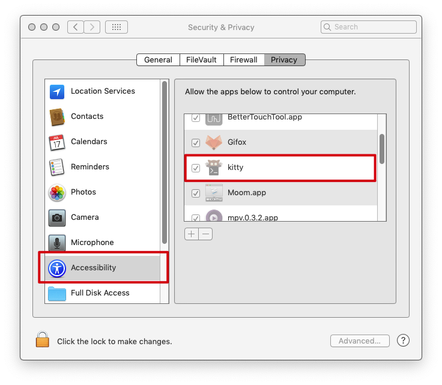

# Intro
mathpix api version
only Mac support. 
> if you Mac OS version is bigger than 10.14, you need to grant accessibility to your terminal. 


# Install
``` bash
pip3 install mathsnip
```


# Usage
Must use root permission. Because it needs to catch the global key.
``` bash
sudo mathsnip -i <app_id> -k <app_key>
```

wait untill you see . it takes about 3 secs for cv to init.


press `cmd+shift+e` to clip the screen. 


